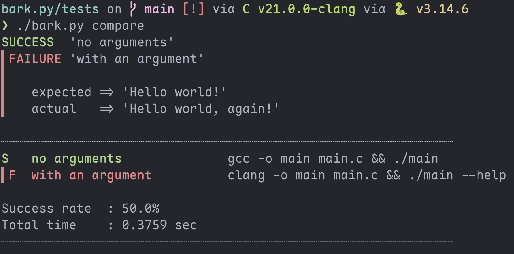

<p align="center">
    
</p>
  
<p align="center">
  <em>A minimal snapshot testing tool<br>to harden the bark of your code.</em>
</p>
  
<p align="center">
    
  
</p>
  
<p align="center">
  <a href="#info">Info</a> •
  <a href="#usage">Usage</a> •
  <a href="#screenshots">Screenshots</a> •
  <a href="#license">License</a>
</p>  
  
---
<div id="info"></div>
  
## Info
    
### General
  
I built this tool to integrate nicely with the various things I'm building in
different languages - for the projects where simple unit tests are not enough.
My main constraints when building this tool was that it needed to be simple to use and (most importantly) language- and toolchain-agnostic.
  
### Snapshot testing
  
**bark.py** uses the stdout/stderr of your test-subject to determine its success-condition. It achieves this by first recording a "source of truth" onto disk, and then comparing that to your subsequent tests. By setting up this kind of workflow you can introduce more certainty into your development progression.
  
*"There are already hundreds of scripts and programs that implement this, so why should
I use ***bark.py***?"* you may say - and I don't care.
  
### Requirements
- Python 3.10+
  
---
<div id="usage"></div>
  
## Usage
  
### Setup
  
Choose a directory in your codebase where you want to use *bark.py* -
create a new file called `bark_test` in that directory:
``` bash
cd my/program/test
curl -O https://raw.githubusercontent.com/simon-danielsson/bark.py/refs/heads/main/bark.py
touch bark_test
```
  
Within `bark_test` you write the commands of each test you wish to execute, one command per line! Following the pattern `<name of test>|<test command>`:
``` terminal
add_nums() | gcc -o main main.c && ./main --test_nums
print_list() | gcc -o main main.c && ./main --test_print
# bark.py supports comments! The parser skips all lines starting with '#'.
```
  
### CLI
  
**bark.py** comes with *two* commands:
``` terminal
record
    * Reads a file 'bark_test' with shell commands to be executed.
    * Executes each command and saves their respective stdout/err to a file
      inside a generated directory '.bark'.

compare
    * Runs the same file of shell commands again and compares their
      stdout/err to their recorded counterparts in the '.bark' directory.
    * Prints a summary.
```
  
Within the directory of your `bark_test` file, you run `./bark.py record` to
record the output of your tests and generate a folder `.bark`.  
  
Once you've progressed enough in your development process to warrant a test, you
simply `cd` back into the directory of your `bark_test` file and run `./bark.py
compare` - to compare your current output with what you had previously recorded.
    
See the [tests](./tests) directory for a simple showcase
  
---
<div id="screenshots"></div>
  
## Screenshots
  

  
---
<div id="license"></div>
  
## License
  
This project is licensed under the [MIT License](https://github.com/simon-danielsson/bark.py/blob/main/LICENSE).  
